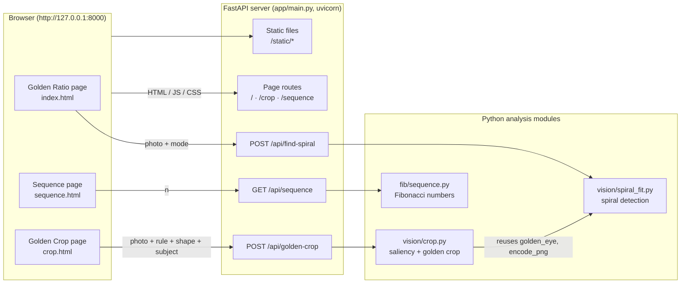
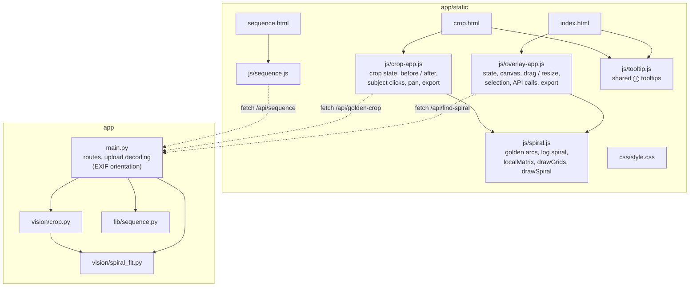
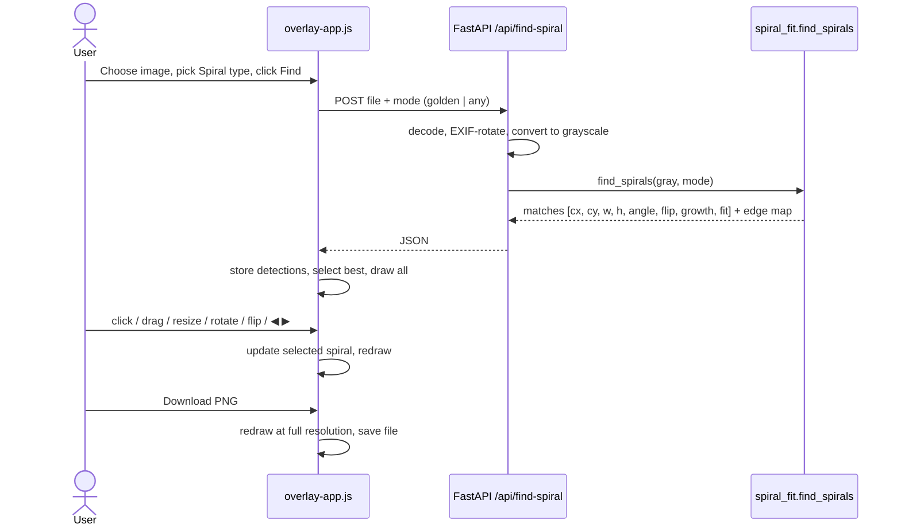
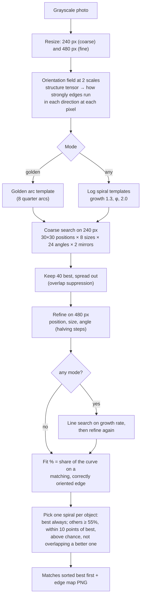
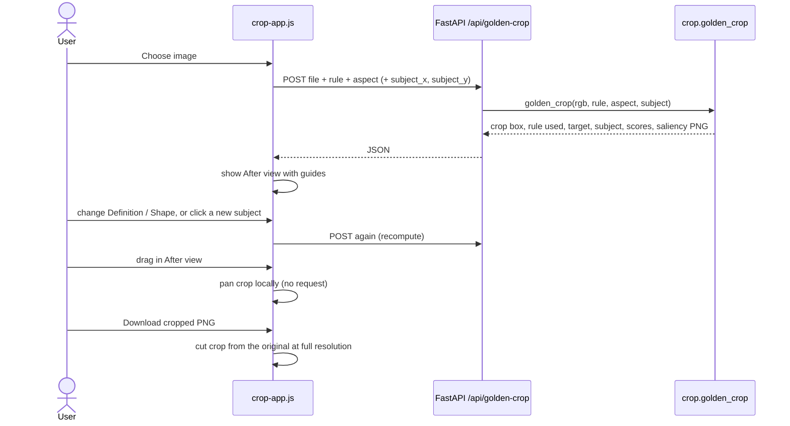
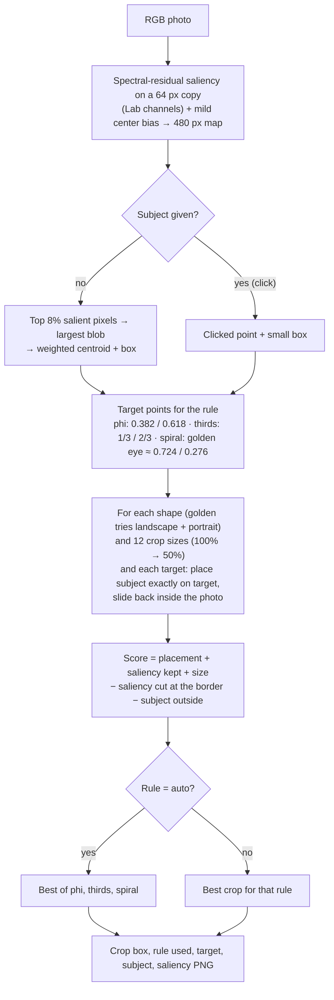
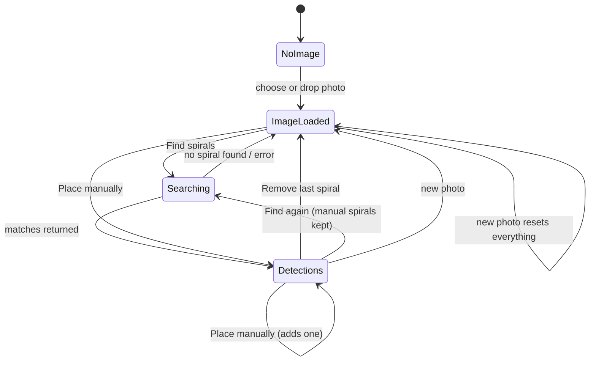

# Architecture

Fibonacci Fun is a small local web app. A FastAPI server serves three static pages and two image-analysis endpoints. All drawing and editing happens in the browser on a `<canvas>`, and the server only does the heavy image analysis.

## System architecture

- The photo never leaves the machine. The browser uploads it to the local server for each analysis, and the server keeps nothing between requests.
- Pages are plain ES modules with no build step; `python -m app` (`app/__main__.py`) starts uvicorn and opens the browser.

## Components

| Component                  | Responsibility                                                                                                                                                         |
| -------------------------- | ---------------------------------------------------------------------------------------------------------------------------------------------------------------------- |
| `app/main.py`              | FastAPI app, page routes, API routes, image decoding with `ImageOps.exif_transpose` so server coordinates match what the browser draws.                                |
| `app/vision/spiral_fit.py` | Edge-orientation field, golden and log spiral templates, coarse search, refinement, fit %, one-spiral-per-object selection.                                            |
| `app/vision/crop.py`       | Spectral-residual saliency, subject detection, rule target points, crop search and scoring.                                                                            |
| `app/fib/sequence.py`      | Pure Fibonacci sequence function.                                                                                                                                      |
| `static/js/spiral.js`      | Shared geometry and drawing. It mirrors the Python templates (`goldenSteps` ↔ `golden_arcs`, `logSpiral` ↔ `log_spiral`) so server matches line up with what is drawn. |
| `static/js/overlay-app.js` | Golden Ratio page: composition layer, list of detected spirals and the selected one, hit testing, drag / resize / rotate / flip, padding, PNG export.                  |
| `static/js/crop-app.js`    | Golden Crop page: requests, before / after views, guides, subject clicks, panning the crop, cropped PNG export.                                                        |
| `static/js/tooltip.js`     | One floating tooltip for every `[data-tip]` element (hover, focus, tap).                                                                                               |

### Spiral model (shared by server and browser)

A spiral is `{ cx, cy, w, h, angle, flip, growth }`: an unrotated `w × h` box around its center, turned by `angle` degrees and optionally mirrored. `growth` is `null` for the golden arc spiral, or the growth per quarter turn for a log spiral. Both sides draw the curve in the same unit frame (`aspect × 1`, starting where the golden arcs start), so a match from the server lands exactly on the drawn overlay.

## Flow: Find spirals

## Algorithm: spiral detection

- **Score** (used for searching): the average of √(edge strength along the curve's direction), weighted toward the long outer arcs. Only the part of the curve that lies inside the photo counts, and at least 60% must be inside.
- **Fit %** (shown to the user): the weighted share of the curve that has a supporting edge. On the sample photos, random placements score a median of about 6–23%.

## Flow: Golden crop

## Algorithm: golden crop

## Page state: detected spirals (Golden Ratio page)

## Design choices

- **No build step, no frameworks.** Vanilla ES modules and one stylesheet keep the app small and easy to run.
- **Analysis on the server, drawing in the browser.** NumPy and OpenCV do the heavy search, and the canvas handles smooth interaction and exports at any resolution.
- **Shared geometry.** The spiral templates are defined identically in Python and JavaScript, which lets the server return compact parameters instead of drawings.
- **Honest scores.** Fit % is an absolute measure checked against random placements, so a "strong" match is meaningfully better than chance.
- **No extra dependencies.** Saliency is implemented in NumPy because `cv2.saliency` is not part of `opencv-python-headless`.
