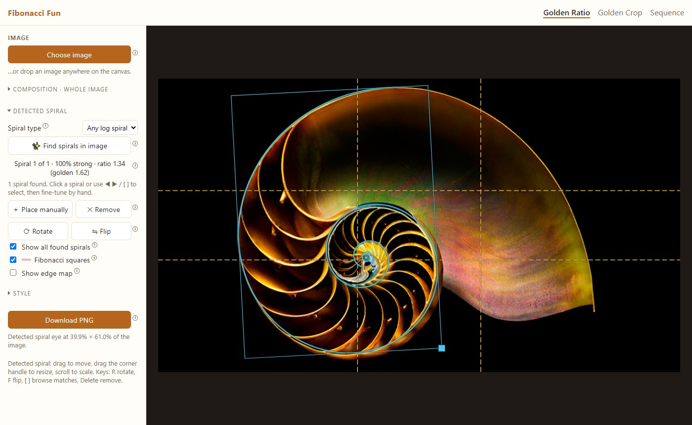
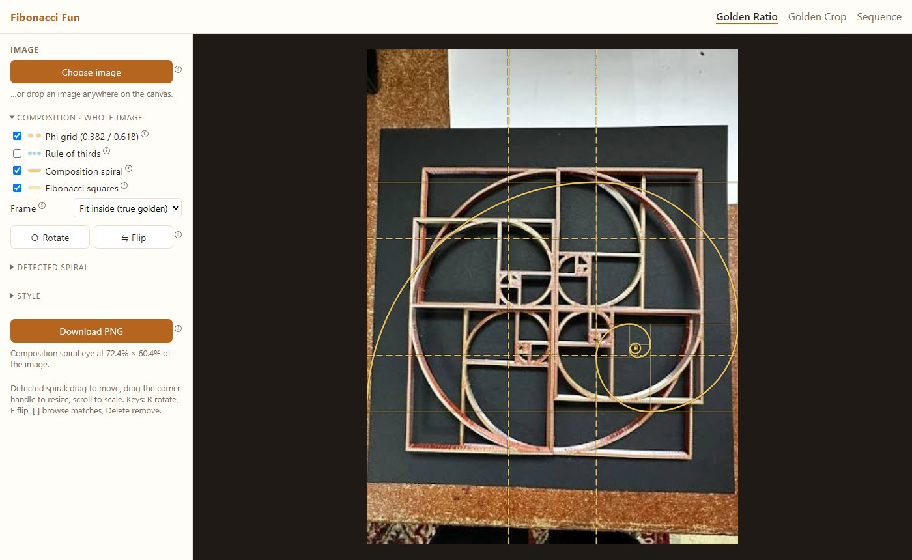
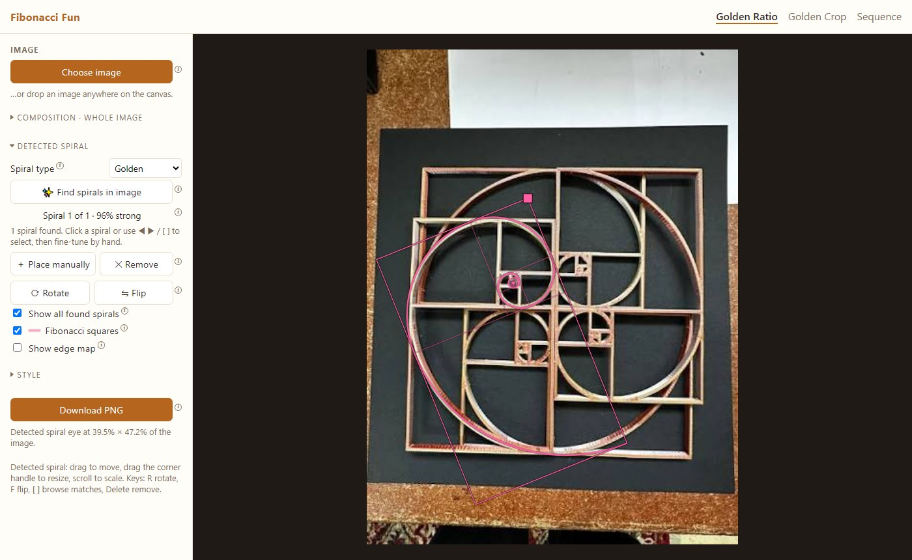
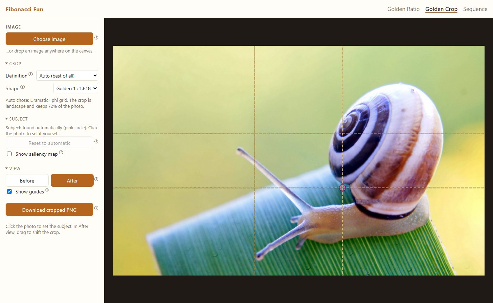
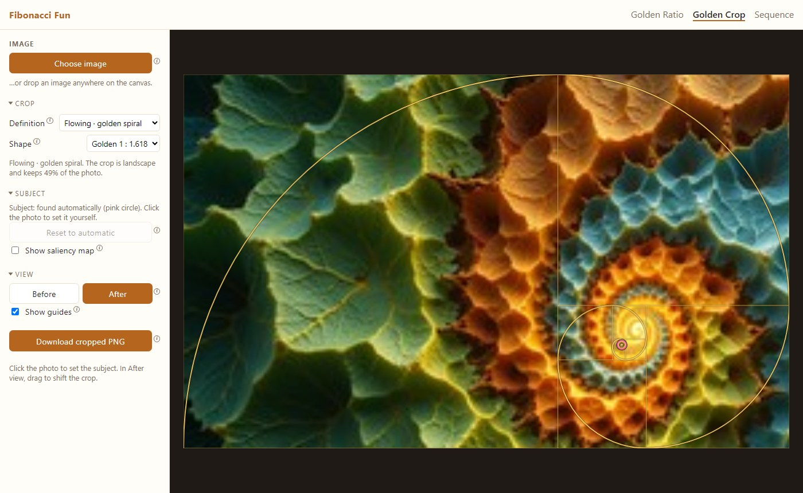
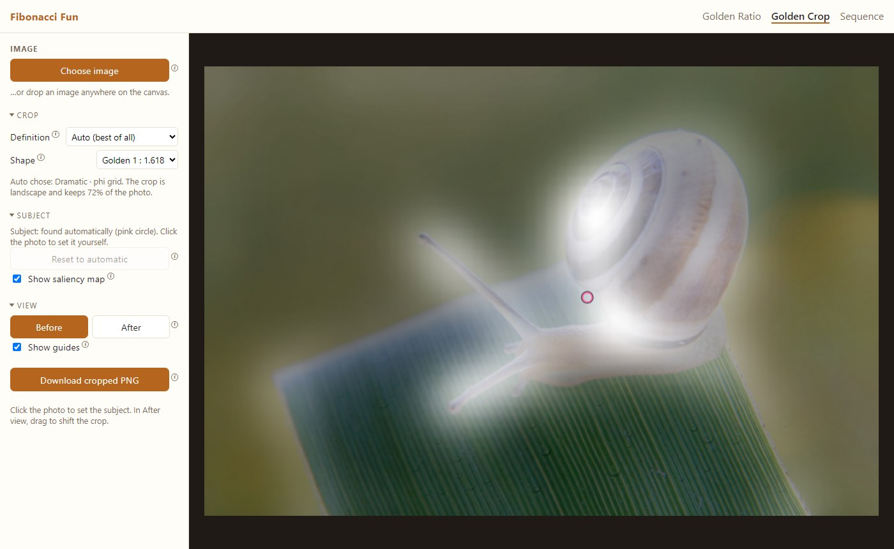
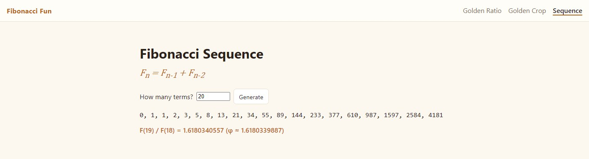

# User Manual

This manual walks through every page and control of Fibonacci Fun. Every option in the app also has a small ⓘ next to it: hover it (or tap it, or Tab to it) for a one-line explanation.

## Contents

1. [Starting the app](#1-starting-the-app)
2. [Golden Ratio page](#2-golden-ratio-page)
3. [Golden Crop page](#3-golden-crop-page)
4. [Sequence page](#4-sequence-page)
5. [Keyboard and mouse reference](#5-keyboard-and-mouse-reference)
6. [Understanding the numbers](#6-understanding-the-numbers)
7. [Tips and troubleshooting](#7-tips-and-troubleshooting)

## 1. Starting the app

1. Open PowerShell in the project folder.
2. The first time only, install everything:
   ```powershell
   py -3.12 -m venv .venv
   .venv\Scripts\activate
   pip install -r requirements-dev.txt
   npm install
   ```
3. Start the app:
   ```powershell
   .venv\Scripts\activate
   python -m app
   ```
4. Your browser opens at `http://127.0.0.1:8000`. If it doesn't, open that address yourself.
5. To stop the app, press `Ctrl+C` in the PowerShell window.

The header links switch between the three pages: **Golden Ratio**, **Golden Crop** and **Sequence**. Photos stay on your computer: they are only sent to this local app.

## 2. Golden Ratio page



The left panel has four parts: **Image**, and the collapsible sections **Composition · whole image**, **Detected spiral** and **Style**. The sections start collapsed; click a title to open or close it.

### 2.1 Load a photo

- Click **Choose image**, or drag a photo onto the dark canvas area.
- The photo appears with the **phi grid** switched on.

### 2.2 Composition · whole image

These guides always cover the whole frame. They help you judge the composition of the photo as it is.



| Control                      | What it does                                                                                                                                                                                                                                |
| ---------------------------- | ------------------------------------------------------------------------------------------------------------------------------------------------------------------------------------------------------------------------------------------- |
| **Phi grid (0.382 / 0.618)** | Lines at 38.2% and 61.8% of the frame, the golden-ratio cousin of the rule of thirds. Key subjects look good on the lines or where they cross.                                                                                              |
| **Rule of thirds**           | The classic 1/3 and 2/3 grid, in blue, for comparison.                                                                                                                                                                                      |
| **Composition spiral**       | A golden spiral over the frame. Put the main subject near its eye and let lines in the photo follow the curve.                                                                                                                              |
| **Fibonacci squares**        | The squares the spiral is built from (1, 1, 2, 3, 5, 8, …).                                                                                                                                                                                 |
| **Frame**                    | **Fit inside (true golden)**: the largest true 1 : 1.618 rectangle, centered, which may leave gaps. **Stretch to image**: fills the photo but squashes the spiral. **Pad to golden**: adds borders so the whole frame is exactly 1 : 1.618. |
| **Padding**                  | Appears in Pad mode. Fills the added borders with a **Blurred photo**, **Black** or **White**. It is included in the download.                                                                                                              |
| **⟳ Rotate / ⇋ Flip**        | Turn the composition spiral 90° or mirror it. Try the combinations to see which suits the photo.                                                                                                                                            |

### 2.3 Detected spiral: find spirals in the photo

1. Open **Detected spiral**.
2. Choose a **Spiral type**:
   - **Golden**: only the true golden spiral, which grows 1.618× every quarter turn. Takes about 2 seconds.
   - **Any log spiral**: also tighter or looser spirals, such as nautilus shells, and shows each one's growth ratio. Takes about 5–8 seconds.
3. Click **✨ Find spirals in image**.
4. Found spirals are drawn on the photo, best first. The label shows, for example:
   - `Spiral 1 of 1 · 96% strong` (golden)
   - `Spiral 1 of 1 · 100% strong · ratio 1.34 (golden 1.62)` (any log spiral)
5. If several spirals were found (one per object), use **◀ ▶** or click a spiral to select it. The selected one is drawn in full with its frame and resize handle; the others are thinner.



**Editing the selected spiral:**

| Action       | How                                                                     |
| ------------ | ----------------------------------------------------------------------- |
| Move         | Drag inside its frame                                                   |
| Resize       | Drag the square handle at its corner, or scroll the mouse wheel over it |
| Rotate 90°   | **⟳ Rotate** or the `R` key                                             |
| Mirror       | **⇋ Flip** or the `F` key                                               |
| Delete       | **✕ Remove** or the `Delete` key                                        |
| Add your own | **＋ Place manually**, then drag it into place                          |

Other options:

- **Show all found spirals**: untick it to see only the selected spiral.
- **Fibonacci squares**: shows the squares inside detected golden spirals. Log spirals have no squares.
- **Show edge map**: shows the edges the search looked at (available after Find). Bright lines are what the spiral tries to follow, which is useful for understanding a match.

Running **Find** again replaces the found spirals but keeps the ones you placed manually.

### 2.4 Style

| Control                 | What it does                                                                                   |
| ----------------------- | ---------------------------------------------------------------------------------------------- |
| **Composition color**   | Color of the grids and composition spiral                                                      |
| **Golden spiral color** | Color of detected golden spirals (pink by default)                                             |
| **Log spiral color**    | Color of detected non-golden spirals (blue by default)                                         |
| **Opacity**             | How see-through the overlay lines are                                                          |
| **Line width**          | Thickness of the lines, on screen and in the download                                          |
| **Spiral eye**          | Marks the point the spiral winds into. Its position is also written under the Download button. |

### 2.5 Download

**Download PNG** saves the photo at full resolution with everything currently shown, except the resize handle. In Pad mode the padding is included.

## 3. Golden Crop page

Golden Crop re-crops a photo so its subject sits on a golden point.



### 3.1 Quick use

1. Click **Choose image** (or drop a photo).
2. The page shows the **After** view: the suggested crop with its guides.
3. Click **Download cropped PNG** to save it.

### 3.2 Crop

| Control        | Options                                                                                                                                                                                                                                                                                              |
| -------------- | ---------------------------------------------------------------------------------------------------------------------------------------------------------------------------------------------------------------------------------------------------------------------------------------------------- |
| **Definition** | **Auto (best of all)** tries all three rules and keeps the best, and the panel says which it chose. **Dramatic · phi grid** puts the subject on a 0.382 / 0.618 crossing. **Interesting · rule of thirds** puts it on a 1/3 / 2/3 crossing. **Flowing · golden spiral** puts it at the spiral's eye. |
| **Shape**      | **Golden 1 : 1.618** (landscape or portrait, whichever works better), **Keep original**, **Square 1 : 1**, **Portrait 4 : 5**, **Classic 3 : 2**, **Wide 16 : 9**.                                                                                                                                   |

The text under these controls tells you the rule used, whether the crop is landscape, portrait or square, and how much of the photo it keeps. These rules are photographers' rules of thumb, not laws, so try a few and keep the one you like.



### 3.3 Subject

- The subject is found automatically and marked with a **pink circle**.
- If it picked the wrong thing, **click the real subject** on the photo (in either view) and the crop is recomputed.
- **Reset to automatic** goes back to the automatic guess.
- **Show saliency map** shows how eye-catching each area is: brighter means more eye-catching. The automatic subject is the brightest area.



### 3.4 View

- **Before**: the original photo, untouched (only the subject circle is shown).
- **After**: the cropped result. **Drag** the picture to shift the crop by hand.
- **Show guides**: turns the phi grid, thirds lines or spiral on the After view on or off.

### 3.5 Download

**Download cropped PNG** saves only the cropped area, at full resolution, without guides or markers.

## 4. Sequence page



1. Enter **How many terms?** (1 to 1000).
2. Click **Generate**.
3. The page lists the numbers, and shows the ratio of the last two next to φ ≈ 1.6180339887. The ratio gets closer to φ the more terms you ask for.

## 5. Keyboard and mouse reference

Golden Ratio page, acting on the selected detected spiral:

| Key / gesture               | Action                       |
| --------------------------- | ---------------------------- |
| `R`                         | Rotate 90°                   |
| `F`                         | Flip (mirror)                |
| `[` / `]`                   | Previous / next found spiral |
| `Delete` or `Backspace`     | Remove the selected spiral   |
| Drag inside the frame       | Move                         |
| Drag the corner handle      | Resize                       |
| Mouse wheel over the spiral | Scale                        |
| Click another spiral        | Select it                    |

Golden Crop page:

| Gesture                | Action                |
| ---------------------- | --------------------- |
| Click on the photo     | Set the subject there |
| Drag in the After view | Shift the crop        |

Everywhere: hover, tap or Tab to an **ⓘ** to read its tip, and press `Esc` to close it.

## 6. Understanding the numbers

**Fit %** (detected spirals) is how much of the spiral's curve runs along a matching edge in the photo, in the right direction.

| Fit        | Label  | Meaning                                  |
| ---------- | ------ | ---------------------------------------- |
| 85% and up | strong | The curve follows the photo very closely |
| 70–84%     | good   | Clearly spiral-shaped                    |
| 55–69%     | fair   | Partly spiral-shaped                     |
| below 55%  | weak   | Probably chance                          |

On the sample photos, random placements score a median of about 6–23%, so a strong or good match is far above chance.

**Ratio** (Any log spiral mode) is how much the spiral grows every quarter turn. A true golden spiral is 1.62 (φ). Nautilus shells are typically about 1.3, and looser spirals are 2 and above.

**Spiral eye position** is given as a percentage across and down the image (or the padded frame in Pad mode).

## 7. Tips and troubleshooting

- **Find picks the wrong object or nothing useful.** Find works best when the spiral is large in the frame, about a quarter of the photo's height or more. Crop the photo closer to the spiral first, or use **＋ Place manually**.
- **A shell is traced poorly in Golden mode.** Most real shells aren't golden spirals. Switch **Spiral type** to **Any log spiral**.
- **Flowers like sunflowers and pine cones.** They are made of many interleaved spirals, not one curve, so Find does not trace them as one spiral.
- **Golden Crop cuts part of the subject.** The automatic subject may be only the brightest part of an object. Click the center of the real subject, or try another **Definition** or **Shape**.
- **"Could not read that image."** Use a common format (JPEG, PNG, WebP). Phone photos are rotated automatically.
- **The page doesn't open.** Check that `python -m app` is still running and nothing else uses port 8000.
